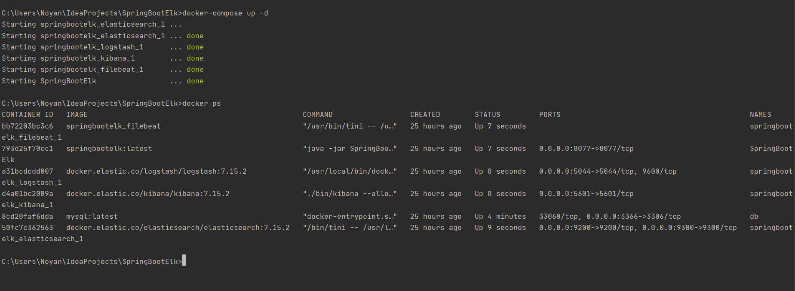
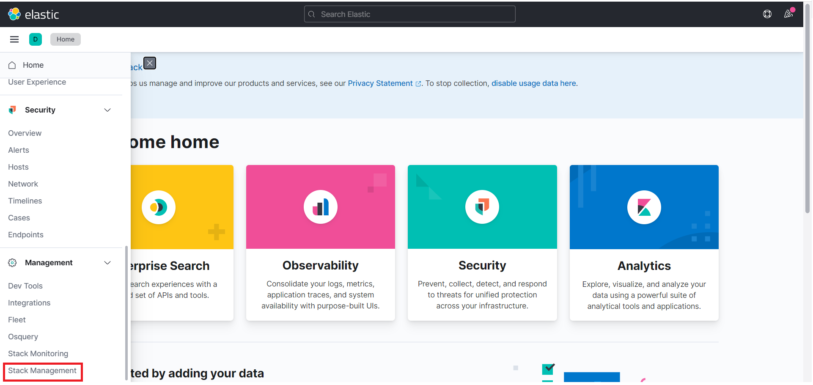
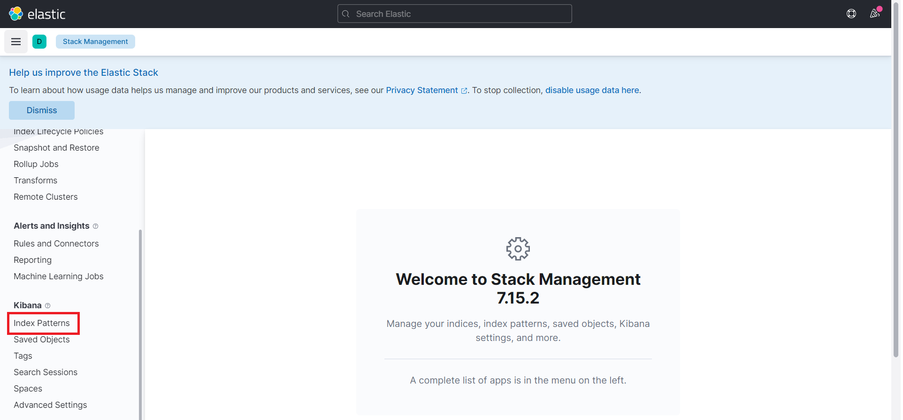
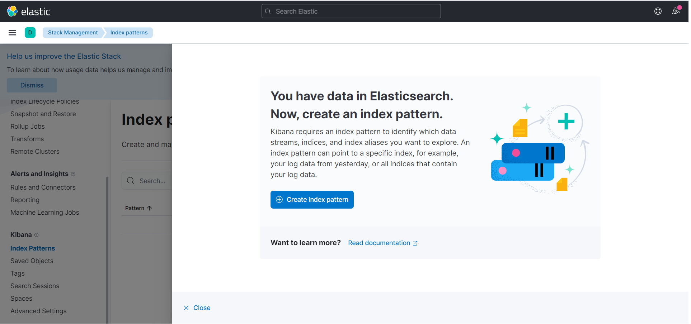
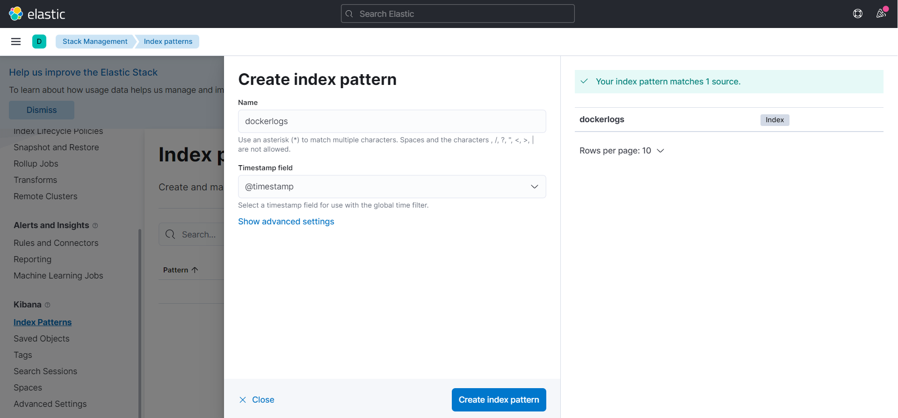
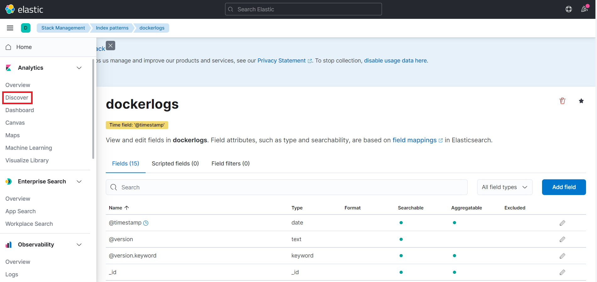
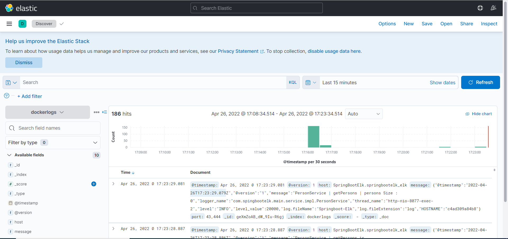

# Spring Boot ELK(ElasticSearch, Logstash, Kibana)


### 📖 Information

<ul style="list-style-type:disc">
  <li>The aim of app manages collect logs from app through Logstash and then analyze them in ElasticSearch before visualizing them in Kibana</li>  
  <li>Here is the explanation of the project
      <ul>
        <li>docker-compose reads variables from .env file.</li>
        <li>Implement the process of all CRUD operations to add logs through Postman</li>
        <li>Send Logs defined in configuration to Logstash through Filebeat</li>
        <li>Collect logs and transform them through Logstash</li>
        <li>Search and analyze them through ElasticSearch</li>
        <li>Visualize and manage them through Kibana</li>
      </ul>
  </li>
</ul>

### 🔨 Run the App

#### Maven

<b>1 )</b> Download your project from this link `https://github.com/Rapter1990/SpringBootElk`

<b>2 )</b> Go to the project's home directory :  `cd SpringBootElk`

<b>3 )</b> Create a jar file though this command `mvn clean install`

<b>4 )</b> Run the project though this command `mvn spring-boot:run`


#### Docker

<b>1 )</b> Install <b>Docker Desktop</b>. Here is the installation <b>link</b> : https://docs.docker.com/docker-for-windows/install/

<b>2 )</b> Look at the <b>.env</b> file in project's root directory if database schema, username or password are needed to be changed 

<b>3 )</b> Use the command to read variables from <b>.env</b> file.
```
    docker-compose config
```
<b>4 )</b> Open <b>Terminal</b> under <b>resources</b> folder to run <b>all containers</b> on <b>Docker</b> Container
```
    docker-compose up -d
```
<b>5 )</b> Open <b>ElasticSearch</b> in the Browser 
```
    http://localhost:9200
```
<b>6 )</b> Show <b>Indexs</b> in the <b>ElasticSearch</b> 
```
    http://localhost:9200/_cat/indices?v
```
<b>7 )</b> Open <b>Kibana</b> in the <b>Browser</b>
```
    http://localhost:5601/
```

<b>8 )</b> Explore Rest APIs
<table style="width:100%">
  <tr>
    <th>Method</th>
    <th>Url</th>
    <th>Description</th>
    <th>Valid Request Body</th>
    <th>Valid Request Params</th>
  </tr>
  <tr>
    <td>POST</td>
    <td>/api/api/persons/save</td>
    <td>Save Person</td>
    <td><a href="README.md#save">Info</a></td>
    <td></td>
  </tr>
  <tr>
      <td>PUT</td>
      <td>/api/api/persons/{id}</td>
      <td>Update Person By Id</td>
      <td><a href="README.md#updatePersonById">Info</a></td>
      <td></td>
  </tr>
  <tr>
      <td>GET</td>
      <td>/api/api/persons/{id}</td>
      <td>Get Person By Id</td>
      <td></td>
      <td><a href="README.md#getPersonById">Info</a></td>
  </tr>
  <tr>
      <td>GET</td>
      <td>/api/api/persons</td>
      <td>Get all Persons</td>
      <td></td>
      <td><a href="README.md#getPersons">Info</a></td>
  </tr>
  <tr>
      <td>DELETE</td>
      <td>/api/api/persons/{id}</td>
      <td>Delete Person By Id</td>
      <td></td>
      <td><a href="README.md#deletePersonById">Info</a></td>
  </tr>
</table>

### Used Dependencies
* Spring Boot Web
* ElasticSearch
* Logstash
* Kibana
* Filebeat


## Valid Request Body

##### <a id="save">Upload -> http://localhost:8077/api/api/persons/save</a>
```
    {
        "username" : "person1",
        "name" : "Person 1 ÜĞİŞÇÖüğişçö",
        "surname" : "Person 1 Surname",
        "email" : "person1@person.com",
        "birthDate" : "2022-04-13",
        "password" : "111111"
    }
```

##### <a id="updatePersonById">Update Person By Id-> http://localhost:8077/api/api/persons/{id}</a>
```
   {
       "username" : "person1",
       "name" : "Person 1 ÜĞİŞÇÖüğişçö Updated",
       "surname" : "Person 1 Surname Updated",
       "email" : "person1_updated@person.com",
       "birthDate" : "2022-04-12",
       "password" : "222222"
   }
```

## Valid Request Params

##### <a id="getPersonById">Get Person by Id -> http://localhost:8077/api/api/persons/{id}</a>
```
   http://localhost:8077/api/api/persons/26
```

##### <a id="getPersons">Get all Persons -> http://localhost:8077/api/api/persons</a>
```
   http://localhost:8077/api/api/persons
```

##### <a id="deletePersonById">Delete Person By Id -> http://localhost:8077/api/api/persons/{id}</a>
```
   http://localhost:8077/api/api/persons/26
```

### Screenshots

<details>
<summary>Click here to show the screenshots of project</summary>
    <p> Figure 1 </p>
    
    <p> Figure 2 </p>
    
    <p> Figure 3 </p>
    
    <p> Figure 4 </p>
    
    <p> Figure 5 </p>
    
    <p> Figure 6 </p>
    
    <p> Figure 7 </p>
    
</details>


